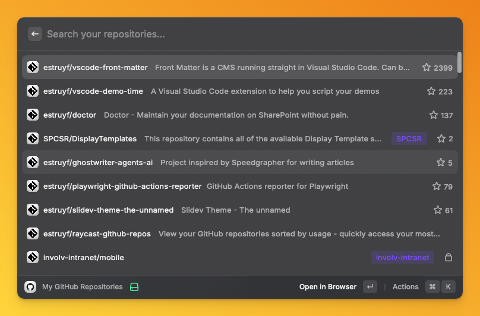

# GitHub Repositories for Raycast

View your GitHub repositories sorted by your personal usage. The extension
learns which repositories you access most frequently and keeps them at the top
for quick access.

  
  
<em>GitHub Repositories</em>

## Features

- **Smart Sorting**: Repositories you access frequently appear at the top
- **Activity Based**: Also sorts by stars, recent activity, and usage
- **Search**: Quickly find any of your repositories
- **Quick Actions**:
  - Open in browser
  - Copy URL to clipboard
  - Copy repository name
- ⚡ **Fast**: Responsive interface with caching

## Usage

1. Open Raycast
2. Search for "My GitHub Repositories"
3. Browse your repositories sorted by usage
4. Press Enter on any repository to open it in your browser

